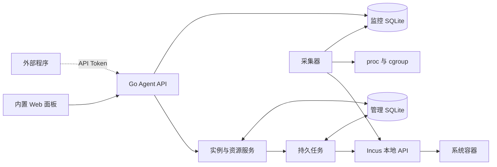

# 母机 Agent 实现方案

状态：完整 Shape 方案，等待用户最终确认。已选择的功能和参数与管理规格一致；本文件同时列出提交完整确认的工程默认值，当前未实现、未完成实机验收。

## 交付与技术栈

首期交付 Debian 13 x86_64 母机 Agent，使用 Go，单个 systemd 服务运行。Vue 3 + TypeScript + Vite 构建的静态前端嵌入二进制；母机运行面板不需要 Node 服务。通过 Incus 本地 Unix socket 管理系统容器。

使用 Debian 13 官方 incus-base 与 incus-client 作为容器后端基线。2026-09-11 官方页面为 6.0.4-2+deb13u9；允许同系列安全修订，安装时记录实际版本并检查必要 API 能力，不依赖仅在上游 main 出现的新字段。

交付包含源代码、构建说明、Linux amd64 安装包、安装/升级脚本、systemd 单元、配置示例、OpenAPI 文档和 VMware 验证步骤。已有实例迁移不在本项目范围。

## 组件关系

管理数据和指标历史分开存储，便于分别控制事务、保留和查询开销。后台采集不依赖浏览器打开；Web 终端与小鸡进程诊断刷新是按需会话。

业务流量由 Incus 管理的转发与内核网络规则处理，Agent 管理进程不是默认流量代理。Agent 重启时保持已运行实例和有效转发。对应 A57。

## 初始资源模板

| 系统 | CPU 上限 | 内存上限 | 系统盘额度 | 带宽 | 初始端口 |
| --- | --- | --- | --- | --- | --- |
| Alpine（默认） | 0.5 核 | 128 MiB | 1 GiB | 不限制 | 20 个号码 |
| Debian 13 | 0.5 核 | 256 MiB | 4 GiB | 不限制 | 20 个号码 |

创建时可调整，界面区分额度和实际占用。模板是本地轻负载实验起点，不是已实测的最低内存或所有实例同时满载的保证。CPU 允许超分；内存与磁盘配置由后端实际限制，创建前检查可用空间和参数，展示配置总量与实际余量。对应 A58。

镜像使用已记录的稳定版本、来源与指纹。常用系统做成就绪镜像供后续创建复用；镜像更新只影响显式新建或重装，不静默替换运行中实例。创建后通过实例内核对补齐登录与网络配置，不把 cloud-init 成功当成唯一就绪条件。

## 存储与配置

使用专用 Incus LVM thin pool、每实例逻辑卷和 ext4 文件系统。实验环境由 Incus 创建新的专用 loop 后备文件；不强制复用或清空已有卷组。

50GB 虚拟磁盘在实际安装后核对可用空间。初始池取不超过 32 GiB，且在池外至少保留 8 GiB 可用空间；不足以满足基础安装与镜像需求时报告不足，不强行继续。模板额度不表示物理空间已预留，监控池真实余量，空间不足时拒绝新的分配。

路径约定：
- 程序：/opt/particeps/particeps-agent。
- 配置：/etc/particeps/config.yaml。
- 管理数据：/var/lib/particeps/state.db。
- 历史数据：/var/lib/particeps/metrics.db。
- 备份：/var/lib/particeps/backups。
- 服务：particeps-agent.service。

配置和数据目录限制写权限，密钥与待执行初始化凭据不以明文进入普通记录、列表或日志。配置变更使用原子写入；只调整本项目管理路径。

参考 [Incus LVM 文档](https://linuxcontainers.org/incus/docs/main/reference/storage_lvm/) 的独立卷组与 thin pool 契约。Btrfs qgroup 的限制已调查，本方案不依赖其提供严格系统盘边界。

## 实例身份、任务和资源一致性

使用专用 Incus 项目和明确的归属元数据；管理 UUID 与 Incus 名称对应，业务显示名可以独立修改。未知实例不自动纳管或清理。

实例管理意图、资源分配和任务记录保存于管理数据库；Incus 状态是实际运行证据。任务接收、容器启动、初始化完成与外部连通性分别表达。

默认并发 2 台，可配置；同一实例串行，不同实例受控并发。单台失败继续其他任务，保留成功结果。任务持久化并记录 Incus 操作引用，恢复时先核对，不重放结果不明的重装。创建、重装等变更使用幂等键；重复请求的完整行为见管理规格 A43–A46。

端口和 IP 先登记归属再应用后端，失败保留可核对状态；删除后先确认资源清理再释放。改变新建默认值不自动重分配已有实例资源。

期望电源状态写入管理记录，并设置 Incus 开机自启。Agent 启动时按期望状态核对，不把历史创建状态当成当前应运行。对应 A66。

CPU 额度按“核”存储为小数，语义为时间硬上限。0.5 核写入 Incus `limits.cpu.allowance=50ms/100ms`；1 核为 `100ms/100ms`；2 核为 `200ms/100ms`。不使用 `limits.cpu.allowance=50%` 软限制。可选绑核写入允许使用的逻辑 CPU 集合，与额度分开。同一“核”口径预留给后续 Podman：CFS `quota = 核 × 100000`、`period = 100000`。KVM 整颗 vCPU 不在首期，不能把 0.5 核直接当成半颗虚拟 CPU。对应 A18、A19。

小鸡合计硬上限写在容纳全部受管实例负载的父 cgroup 的 `cpu.max`（cgroup v2 CFS 带宽）：`quota = 合计核数 × 100000`，`period = 100000`。例如 1.5 核为 `150000 100000`。内核允许子组配额之和大于父组；父组配额用尽后子组即使还有自己的额度也会被节流。不使用 Incus 项目 `limits.cpu` 代替该运行时限制（项目限额只卡配置值之和）。安装时核对本机 Incus 实例 cgroup 是否已落在该父组下；若未嵌套，则建立专用 slice/父组并确保实例负载加入其中。用父组 `cpu.stat` 的节流计数核对合计上限确实生效。对应 A81。

内存使用 Incus `limits.memory`，运行中可改。系统盘使用实例磁盘 `size`，只允许提高。带宽使用网卡 `limits.ingress` 与 `limits.egress`，0 表示清除限制。对应 A61–A63。

停止先发优雅停止；超时或用户选择强制时使用强制停止。对应 A59。

## API、管理账号和访问

采用 /api/v1 HTTP JSON API 和 OpenAPI 契约。长任务返回任务 ID，状态与错误具有稳定字段。面板与外部调用共享校验、授权和任务服务，不直接透传任意 Incus 操作。对应 A55。

首期一个本地管理员账号，密码以不可逆哈希保存；API 使用独立的高熵 Token，分只读与管理权限，可撤销，保存 Token 的校验摘要而不是可反复查询的明文。未认证访问拒绝，只读 Token 无法改配或打开终端。对应 A53。

默认监听 127.0.0.1:8792。Win11 可通过 SSH 隧道访问测试母机；实验需要直连时可显式绑定测试网卡。HTTPS 可由受信任反向代理终止，或配置服务证书；公开部署必须使用 HTTPS。Web 会话、状态变更与终端连接执行身份和来源校验。

首次管理员密码由本地初始化流程设置或生成，不采用公开固定默认密码。凭据初始化与普通服务日志分离。

## 小鸡凭据与终端

支持公钥导入、逐实例密码设置/生成，以及仅公钥模式。无有效公钥时不能以仅公钥模式宣称初始化成功。

生成的初始密码只在受保护的初始化交付中提供；异步执行确需暂存时加密，任务完成后清除，不提供长期明文查询。普通列表、错误和日志脱敏。遗失后可通过已授权密码重置或 Web 终端重新设置。对应 A54、A60。

密码重置通过 Incus 执行通道完成，密码经标准输入交给 `chpasswd`，等待实际结果；不得把密码拼进 shell 命令字符串，也不得只凭命令被接受就报告成功。

重装默认延续已配置公钥，密码按本次请求设置或重新生成，提交前说明。系统盘重装不自动保留旧密码；端口、地址归属和资源配置保留。

小鸡终端通过 Incus 交互会话实现，不经过 SSH。支持输入输出、尺寸调整、退出和连接清理。窗口尺寸必须经控制通道送达实例内会话。仅管理权限可用，会话绑定目标实例；关闭会话不停止小鸡。导入的使用者公钥、关闭密码登录或 SSH 故障都不阻止该通道。首期没有母机终端或终端输入录制。对应 A41。

## 网络落地

Agent 启动和设置页刷新时扫描上行接口：全局 IPv4、全局 IPv6、可识别前缀。管理员在 Web 勾选进入可分配池，并可标记 NAT 入口 IPv4、可独占 IPv4、NAT66 用 IPv6、直路由或同链路前缀。对应 A70、A71。

内部桥接仍由 Incus 管理。需要 IPv4 的小鸡使用可配置私网（初始候选 10.80.0.0/24，重叠则要求调整）。IPv4 SNAT/DNAT 与独立公网 IPv4、IPv6 NAT66、前缀独立 IPv6 按池内勾选启用。同地址族入站映射使用 Incus 内核转发（network forwards 或等价 DNAT），不经 Agent 进程拷贝数据。对应 A72–A76。

有前缀且本次允许 IPv6 时优先分配独立公网 IPv6。独立公网 IPv4 只从勾选为可独占的地址中分配。IPv6-only 小鸡不配置 IPv4，也不建立 IPv4 映射。对应 A35、A74、A76、A78。

连接来源 IP 限制挂在上述 DNAT 之后的 conntrack 上：按小鸡的映射端口组统计唯一源地址，NEW 连接按限额放行或拒绝。后续每源并发、速率、名单类限制使用同一钩子。出厂全局限额 0。对应 A69。

端口池默认 20000–59999，初始每台 20 个号码，TCP/UDP 同归属；首个 TCP 转 22，其余同号，目标可编辑。IPv4 与 IPv6 映射共用号码账本，分别绑定到管理员指定的入口地址。停机/重装保留，删除且清理后回收。

入口展示地址与母机实际上行配置分离。Agent 不自动修改 VMware 或供应商网关。检测成功不等于公网已可达。

## 监控实现

| 项目 | 默认值 |
| --- | --- |
| CPU/网络后台采样 | 5 秒 |
| 选定小鸡进程视图刷新 | 2 秒，离开或切换小鸡取消旧请求 |
| 原始样本保留 | 24 小时 |
| 分钟汇总保留 | 30 天，保留平均、峰值与有效样本信息 |
| 进程历史 | 实时快照，不存全量长期历史；不采集母机进程列表 |

参数可配置。指标采集写入独立数据库，过期清理不影响管理数据和未完成任务；查询按时间范围选择粒度，限制单次返回点数。

CPU 由累计时间差分获得已用核数，小鸡比例相对采样时有效额度；母机总比例相对逻辑 CPU 总量。显示配置总额、容量和超分倍率，不能把额度超分当作新增算力。

网络使用明确的字节与字节/秒单位，选择母机上行与小鸡自身非回环接口。计数器重置、首个样本、缺测和错误保留质量状态，不产生负速率或伪造零值。概览使用同一套母机采样，并展示受管小鸡合计 CPU 与合计硬上限。当前统计周期的累计观测流量可查询并手动重置；重置只清周期计数。对应 A64、A68、A81。

小鸡进程诊断通过实例身份、cgroup 与 PID 命名空间关联，使用 PID 和启动标识区分复用。返回 CPU、RSS 内存等字段，支持按 CPU/内存排序及 PID/名称过滤。具体 Linux 读取实现以实机核对为准，不从 Incus 进程总数伪造列表，也不提供母机 `/proc` 进程表。

## 前端边界

Vue 3 Composition API 与 TypeScript，采用 script setup。路由组件负责组合；请求、轮询和会话放入 composable，排序与过滤使用 computed；不直接修改传入数据。

| 组件 | 职责 | 输入 | 输出事件 |
| --- | --- | --- | --- |
| InstanceTable | 实例列表和选择 | instances、selectedIds | update:selectedIds、open、action |
| BatchCreateForm | 创建参数 | images、defaults、networkPool、capabilities | submit、cancel |
| HostOverview | 母机 CPU/内存/磁盘/负载/运行时间/上行速率，以及小鸡合计 CPU 与总上限 | snapshot | refresh |
| NetworkPoolSettings | 检测结果与勾选可用 IPv4/IPv6 | detected、selected | save |
| ResourceAllocationForm | CPU 额度与绑核、内存、磁盘、带宽 | value、availableCpus | update:value、submit |
| PortAllocationTable | 号码与规则 | allocations、forwards | add、edit、remove |
| BatchProgress | 逐项执行状态 | batch、tasks | retry、open-instance |
| ResourceCharts | 资源图表 | series、range、samplingState | update:range |
| ProcessTable | 选定小鸡内部进程 | processes、sampledAt、sort | update:sort、refresh |
| InstanceTerminal | 交互终端 | instanceId、sessionState | connect、disconnect、resize |

useInstances、useBatchProgress、useResourceSeries、useProcessSnapshot、useTerminalSession 分别管理数据来源和副作用。切换对象时取消旧请求，迟到结果不能覆盖新对象。可见页面刷新和后台历史采集分离，避免浏览器关闭导致历史中断。

## 安装、更新和备份

安装脚本在 Debian 13 上检查架构、空间、权限和现有资源，安装容器后端依赖，准备专用项目、网络、存储及 Agent 服务。发现同名但归属不明资源时停止并说明，不接管或格式化它们。对应 A56。

首期提供手动更新。更新前备份程序版本、配置与管理数据库，校验新包后替换 Agent；不自动升级运行中容器镜像，不重置网络或令牌，不启动周期性远端强制更新。

备份清单明确不包含小鸡系统盘。Agent 移除默认保留配置、数据库、实例及相关网络；清理实例是独立的明确管理操作。管理进程停止或更新时保留已运行实例与有效转发。对应 A57。

## 实施顺序与拆分判断

使用一个 Native Change，按以下顺序实施：
1. Go/Vue 工程、配置与数据库、Incus 适配、认证和版本化 API。
2. 实例生命周期、镜像/SSH、任务恢复、CPU/内存/磁盘/带宽、公网资源池与 IPv4/IPv6 模式、IP/端口、密码重置与强制停止。
3. CPU/网络历史、小鸡进程诊断、Web 终端、母机概览与完整面板。
4. Debian/VMware 实机验收、故障恢复检查、安装包和运维文档。

已执行拆分检测。首期任务围绕同一实例身份、任务状态、资源分配和 API 契约，恢复规则需要共同核对；独立子任务会反复修改这些核心接口，当前协调成本高于并行收益。因此采用单个 Change 的内部步骤，不建立 Supervisor/Child 层级。

## 验证与完成标准

自动检查覆盖任务幂等、故障恢复、分配冲突、CPU 参数、采样差分与保留、认证和前端类型/构建。只运行与实现相关的检查，不以静态配置代替运行验收。

实机基线为 Win11 VMware Workstation 中 Debian 13 x86_64、2 vCPU / 4GB RAM / 50GB 磁盘。覆盖 8 台与 16 台轻负载实例，记录镜像、资源限制、Agent 开销和采样耗时。CPU/内存/磁盘限额压力验证在受控测试实例单独进行。

网络测试区分外部客户端、母机和小鸡；上游 NAT 可用辅助路由角色。辅助角色不计入 Agent 母机资源定义。分别验证 TCP/UDP、SSH、IPv6、上游 NAT、Agent 重启期间已有转发及清理失败，记录真实端点和结果。

用户负责准备 VMware 模拟环境；在需要实机验证时连接其已准备的测试母机，或交付可重复执行的验证步骤并获取实际结果。未获得的实机证据保持待验证，不能用模拟数据或普通 HTTP 200 宣称通过。

全部有效验收均有真实结果，经 Comet 独立复核与 Verify 后再进入交付收尾。当前仅提交完整 Shape，确认后开始实现。
