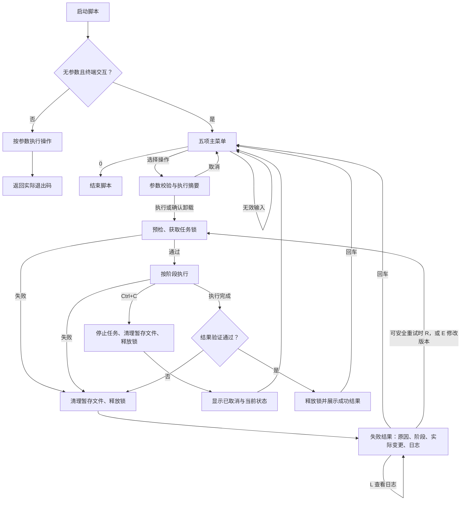

# 安装脚本交互流程

入口为 [deploy/install.sh](../../deploy/install.sh)。无参数且标准输入为终端时进入菜单；带参数时执行指定操作，标准输入不是终端时使用非交互模式。现有五项操作保持为安装/升级、状态、回滚、全部卸载、只卸 Agent。

## 操作与返回

| 场景 | 行为 |
| --- | --- |
| 主菜单 | 输入数字选择，`0` 退出；无效输入重新选择。 |
| 修改操作 | 先显示执行摘要；回车执行，`0` 返回。全卸沿用单独的 `PURGE` 确认。 |
| 安装/升级参数 | 摘要页 `E` 修改 Release；默认沿用本次会话的选择，输入时校验。新池大小也在会话内保留，重新使用前核对可用空间。 |
| 执行过程 | 显示当前阶段。失败立即停止后续步骤，保留诊断日志。 |
| 失败结果 | 显示失败阶段、原因、实际变更与日志路径；等待一次回车后返回发起菜单。 |
| 日志与重试 | 结果页 `L` 查看日志；尚未进入不可安全重复的变更阶段时，失败页提供 `R` 重新预检并重试，安装/升级可用 `E` 修改版本后重试。 |
| 取消 | 执行中 `Ctrl+C` 中止当前任务并清理本次暂存文件，显示已取消及当前状态，随后回菜单。输入时 `Ctrl+C` 返回菜单，终端输入结束则结束会话。 |
| 成功结果 | 显示操作结果；需要服务运行时先核对实际 systemd active 状态，再等待回车返回。升级前停止的 Agent 保持停止。 |
| 命令行模式 | 保留原参数；失败返回非零退出码，不进入菜单或等待结果页输入。 |

每次任务独立持有锁和临时目录，结束后释放；切换菜单清空上次的动作标志。取消或返回菜单不撤销已经完成的安装、配置或删除；结果页会说明已进入的变更阶段和可用备份。卸载不提供直接重试，重新选择后仍需经过相应确认。

诊断日志保存在 `/var/log/particeps-install/`，目录权限 `0700`、文件权限 `0600`，记录阶段信息和标准错误输出。该目录独立于 Agent 数据，因此全卸 particeps 后仍可排错。首次管理员密码只通过终端标准输出展示，不写入诊断日志。

## 流程图

## 验证范围

在 Linux 环境运行 `python3 tests/installer/test_install.py`。测试使用临时目录和 mock 宿主命令，并通过真实 PTY 验证菜单等待、重试、连续操作和终端 `Ctrl+C`。这验证脚本控制流程；实机安装、Incus 生命周期及服务业务可用性仍需相应部署验收，systemd active 不替代 HTTP/API 功能验证。
