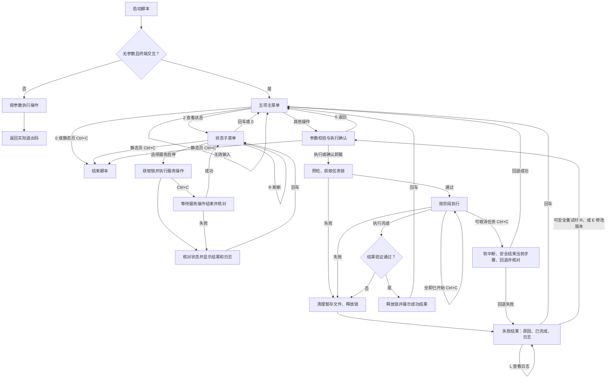

# 安装脚本交互流程

入口为 [deploy/install.sh](../../deploy/install.sh)。无参数且标准输入为终端时进入菜单；带参数时执行指定操作，标准输入不是终端时使用非交互模式。现有五项操作保持为安装或更新、查看状态、恢复备份、全部卸载、仅卸载 Agent。

## 操作与返回

| 场景 | 行为 |
| --- | --- |
| 主菜单 | 输入数字选择，`0` 退出；无效输入重新选择。 |
| 静态页面 | 主菜单、参数输入、执行前确认、结果页和日志页按 `Ctrl+C` 直接退出脚本，不重新绘制菜单。 |
| 安装/更新参数 | 确认页 `E` 修改版本；默认沿用本次会话的选择，输入时校验。新池大小在安装确认前输入，会话内保留，重新使用前核对可用空间。 |
| 可取消任务 | 首次安装、更新、恢复备份、仅卸载 Agent：执行中 `Ctrl+C` 软中断，安全结束当前步骤后回退并核对结果，再返回菜单。重复 `Ctrl+C` 不重新发起回退。 |
| 全部卸载 | 确认页仍可 `Ctrl+C` 退出。输入 `PURGE` 开始后忽略 `Ctrl+C`，命令失败仍停止后续步骤。随后询问是否清除 Incus 时同样：确认页可退出，开始后不可取消。 |
| 查看状态 | 进入状态子菜单，提供 `1` 启动 Incus、`2` 停止 Incus、`3` 启动 Agent、`4` 停止 Agent；`R` 刷新，`L` 查看查询日志，回车或 `0` 返回主菜单。查询中 `Ctrl+C` 停止查询并回主菜单；等待输入时 `Ctrl+C` 退出脚本。 |
| 服务启停 | 共用安装锁，每次操作后核对实际状态；结果页回车返回状态子菜单并刷新。未安装、执行失败或状态未达到预期时显示原因和日志，支持重新预检后重试。执行中 `Ctrl+C` 等待服务操作完成并核对后返回状态子菜单；失败仍停留在结果页。 |
| 执行过程 | 显示当前动作。失败立即停止后续步骤，保留诊断日志。 |
| 失败结果 | 显示失败动作、原因、实际变更与日志路径；等待一次回车后返回发起菜单。 |
| 日志与重试 | 结果页 `L` 查看日志；尚未进入不可安全重复的变更阶段时，失败页提供 `R` 重新预检并重试，安装/更新可用 `E` 修改版本后回到确认页。全部卸载、Incus 清除和回退失败不提供直接重试。 |
| 成功结果 | 显示具体结果；需要服务运行时先核对实际 systemd active 状态。升级前停止的 Agent 保持停止。 |
| 命令行模式 | 保留原参数；失败返回非零退出码，不进入菜单或等待结果页输入。可取消命令完成回退后以中断状态退出。 |

Incus 控制作用于母机的 `incus.service`，存在 `incus.socket` 时一并启停，防止只停服务后被 socket 再次唤起；停止期间实例管理不可用。启动 Agent 会按服务依赖启动 Incus。菜单只调整当前服务运行状态，不修改开机自启设置。命令行 `--status` 仍只输出状态，不进入控制菜单。

每次变更任务独立持有锁和临时目录，结束后释放；切换菜单清空上次的动作标志。首次安装回退会撤销本次写入的程序、配置、专用资源，并移除本次新增软件包；更新回退在已经替换程序后恢复升级前备份。全部卸载开始后不因 `Ctrl+C` 撤销已确认的删除。卸载不提供直接重试，重新选择后仍需经过相应确认。

诊断日志保存在 `/var/log/particeps-install/`，目录权限 `0700`、文件权限 `0600`，记录阶段信息和标准错误输出。该目录独立于 Agent 数据，因此全卸 particeps 后仍可排错。首次管理员密码只通过终端标准输出展示，不写入诊断日志。

## 流程图

## 验证范围

在 Linux 环境运行 `python3 tests/installer/test_install.py`。测试使用临时目录和 mock 宿主命令，并通过真实 PTY 验证菜单等待、重试、连续操作、服务启停与状态回读、缺失服务/socket、静态页退出和执行中中断。这验证脚本控制流程；实机安装、Incus 生命周期及服务业务可用性仍需相应部署验收，systemd active 不替代 HTTP/API 功能验证。
