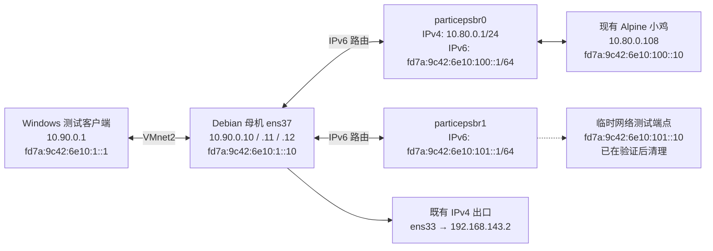

# Particeps 本地网络实验环境

记录日期：2026-09-11。VMware 中的 Debian 母机已经具备三个本地 IPv4 地址和两个供小鸡使用的 IPv6 网段。本次通过操作系统与 Incus 配置建立测试条件，没有修改 Agent 实现或部署新二进制，也没有改变正式验收计数。

随后 F03 已完成端口功能开发、实测和实验服务更新，见 [F03 批次记录](../quality/f03-port-forwarding-2026-09-11.md)。同批安装 conntrack，并启用 `particeps-vmnet2-forwarding.service`：只放行 ens37 上目标为 `.11/.12` 的 DNAT 到 `particepsbr0` 及其返回流量，解决 Docker 的默认 FORWARD DROP。服务配置已保存，尚未做整机重启验证。

这里的 IPv4 是私网地址，`fd7a:9c42:6e10::/48` 是 IPv6 本地地址范围（ULA）。它们适合在这台 Windows 电脑上模拟访问多地址母机和不同网段的小鸡，不代表获得了公网地址、运营商路由或公网 IPv6 出口。

## 网络如何连接

Windows 充当访问小鸡的测试客户端；VMnet2 连接 Windows 与 Debian 母机；母机按目的网段转发流量；Incus 网桥把流量送到小鸡的虚拟网卡。一个 `/64` 表示一整段 IPv6 地址，本次两个小鸡网段彼此不同，也与母机的上联网段分开。



第二个网段当前没有常驻小鸡。临时测试端点是 Linux 网络 namespace（独立的网络环境），不是新建的 Incus 小鸡；测试进程、namespace 和虚拟网卡已经清理。清理后 `particepsbr1` 的路由显示 `linkdown`，因为没有连接中的实例，不应据此宣称网段里已有可访问的小鸡。

## 已保存的配置

| 位置 | 当前配置 | 作用 |
| --- | --- | --- |
| Windows VMnet2，接口索引 103 | `10.90.0.1/24`、`fd7a:9c42:6e10:1::1/64` | Windows 与母机之间的本地链路 |
| 母机 `/etc/network/interfaces.d/particeps-lab` | ens37 的 `.10`、`.11`、`.12` 三个 IPv4 地址及 `fd7a:9c42:6e10:1::10/64` | 三个地址都属于母机；没有把它们当作小鸡独占地址发放 |
| Windows 路由 | `fd7a:9c42:6e10:100::/64` 和 `fd7a:9c42:6e10:101::/64` 都经 `fd7a:9c42:6e10:1::10`、接口 103 | 告诉 Windows：这两段地址要通过母机访问；ActiveStore 与 PersistentStore 均已核对 |
| 母机 `/etc/sysctl.d/90-particeps-lab-ipv6.conf` | `net.ipv6.conf.all.forwarding = 1` | 允许母机把 IPv6 数据包从一张网卡转到另一张 |
| Incus `particepsbr0` | 原 IPv4 地址和 NAT 保留；新增 `fd7a:9c42:6e10:100::1/64`，`ipv6.routing=true`、`ipv6.nat=false` | 第一段小鸡网络；IPv6 直接路由，不做 NAT66 |
| Incus `particepsbr1` | `ipv4.address=none`、`fd7a:9c42:6e10:101::1/64`，`ipv6.routing=true`、`ipv6.nat=false` | 第二段独立的 IPv6 测试网络 |
| 两个网桥的 `raw.dnsmasq` | 分别为 `ra-param=particepsbr0,0,0`、`ra-param=particepsbr1,0,0` | 路由器通告的默认路由有效期为 0，避免给小鸡宣告一个不存在的公网 IPv6 出口 |
| 现有小鸡 `/etc/network/interfaces` | 原 eth0 DHCP IPv4 保留；追加静态 `fd7a:9c42:6e10:100::10/64` 和指向母机的实验范围路由 | 小鸡可经 `fd7a:9c42:6e10:100::1` 返回 `fd7a:9c42:6e10::/48` 实验范围；没有新增 IPv6 默认路由 |
| 小鸡 `/etc/cloud/cloud.cfg.d/99-particeps-lab-network.cfg` | `network: {config: disabled}` | 防止 cloud-init 覆盖本次手工保存的网络配置；以后交由程序管理时需要一并处理 |

现有小鸡名为 `p-911f4462a5e2`，属于 Incus 项目 `particeps`，不是 `default` 项目。查询实例时应明确使用 `--project particeps`；网桥属于 `default` 项目，两者不要混淆。

小鸡还通过路由器通告自动生成了 `fd7a:9c42:6e10:100:1266:6aff:fec6:376f/64`。本次验证使用上表中的固定 `::10` 地址；自动地址不应写死为程序分配结果。

## 实际验证结果

| 检查 | 结果与边界 |
| --- | --- |
| Windows → 母机三个 IPv4 地址 | `.10`、`.11`、`.12` 均 ping 成功 |
| Windows → 母机 IPv6、两个网桥网关 | 均 ping 成功；两条网段路由均已生效 |
| Windows → 现有小鸡 `fd7a:9c42:6e10:100::10` | ping 成功，临时测试资源清理后再次通过 |
| 现有小鸡 → 母机上联 IPv6 | 2 次 ping 均成功，无丢包 |
| Windows → 第二网段临时端点 `fd7a:9c42:6e10:101::10` | ping 成功；TCP 18080 的 HTTP 请求成功，并核对返回内容 `Particeps IPv6 subnet 101 probe`；该端点现已清理 |
| 第二网段临时端点 → 现有小鸡 | 2 次 ping 均成功，证明母机能在两个网段之间转发 |
| 面板页面 | `http://10.90.0.10:8792/` 和 `http://[fd7a:9c42:6e10:1::10]:8792/` 返回 HTTP 200；只证明页面送达，没有执行登录或业务流程验收 |
| 现有服务与路由 | Agent active；原小鸡 RUNNING；母机 IPv4 默认出口仍为 ens33；母机与小鸡均没有 IPv6 默认路由；现有网桥 forward 列表仍为空 |
| 持久配置 | 小鸡 `ifquery` 和 `ifup --no-act` 能解析混合配置；Windows 两个路由存储已核对；母机 sysctl 文件已加载。没有重启 Windows、母机或小鸡，因此不宣称重启恢复已验证 |

临时 HTTP 服务首次启动时地址尚处于 IPv6 重复地址检测的 `tentative` 状态，监听失败；等待地址就绪后重新启动，才执行并通过 HTTP 检查。后续测试工具应显式等待地址退出 `tentative`，并检查 `dadfailed`，不能把写入地址等同于已经可用。

## 配置备份与接续开发

本次修改前的母机网桥、IPv6 sysctl、路由、防火墙及小鸡网络配置备份保存在母机：

```text
/root/particeps-lab-backups/20260911-ipv6-5ymkz1a4/
```

该目录仅供 root 读取。小鸡内另存了一份原始配置 `/etc/network/interfaces.particeps-lab-before-20260911`。需要撤回配置时应结合备份核对后续变更，恢复小鸡配置和 cloud-init 策略、删除对应实验路由，并且只在 `particepsbr1` 没有使用者时删除它；不能直接清空系统防火墙或覆盖后来新增的网络设置。

当前应用仍只有一个配置网络，`internal/incusx/client.go` 的 `EnsureNetwork` 在成功读取既有网桥后直接返回；创建新网桥时则配置 IPv4，并把 IPv6 设为 `none`。本次手工建立的双网段环境不等于它已具备多网桥管理能力。

`internal/core/instances.go` 的 IPv6 地址分配、NIC 写入和路由配置仍有缺口。本次没有通过 Agent API 保存小鸡的新增 IPv6，也不是由面板自动发放的；不能用面板字段或现有 `v6`/`dual` 选项宣称创建功能已通过。共享 IPv4 DNAT 聚合已有 F03 的受限本地实现与实测；NAT66、指定 IPv4 SNAT 出口、真实公网连通与租户隔离仍需各自实现和验收。

2026-09-12 源码/记录核对：原小鸡及共享桥已有 IPv6/SLAAC，而创建 `v4` 模式未见显式禁止 IPv6 的配置，因此这里的旧实例不能继续作为原 A77“只有 IPv4 连通性”的通过证据。严格 IPv4-only 与完整地址池约束在对应网络交付复验，见[进度同步](../quality/native-progress-sync-2026-09-12.md)；本次没有重新连接母机验证当前配置。

F03 已利用本环境完成两个入口 IPv4 的转发实测，测试实例与对象随后清理。后续按 [功能批次](../quality/functional-audit.md) 推进资源限制以及 F04 的 IPv6 配置与分配；本记录没有改变全部 81 项正式验收结论。
