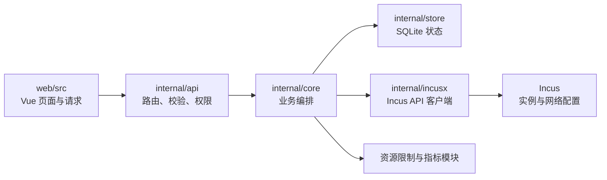

# particeps 项目结构

particeps 是 Go + Vue 的母机管理 Agent：Vue 提供 Web 面板，Go 提供 HTTP API、业务编排和持久化，通过本机 Incus 管理系统容器。前端构建结果嵌入 Go 二进制，母机无需另起 Node 服务。

本页按 2026-09-12 工作区的真实目录、程序入口、导入关系、路由与构建配置整理。这里说明代码的职责和连接方式；功能验收与交付边界见[项目知识入口](project-context.md)和当前 Native 状态。

## 顶层目录

| 目录 | 实际职责 |
| --- | --- |
| [cmd/particeps-agent](../../cmd/particeps-agent/) | Agent 启动入口：读取配置、打开业务应用、准备管理员与 Incus 连接、启动 HTTP 服务。 |
| [internal](../../internal/) | Go 后端：HTTP 接口、认证、实例与网络业务、Incus 调用、SQLite 状态、资源与指标处理、前端嵌入。 |
| [web](../../web/) | Vue 3 + TypeScript 前端源码、页面组件、请求与轮询逻辑、Vite 配置和前端行为测试。 |
| [deploy](../../deploy/) | Agent 配置示例、安装脚本、systemd 服务；`lab/` 保存 VMnet2 实验转发配置。 |
| [tests/netprobe](../../tests/netprobe/) | 实验用 TCP/UDP 服务与客户端，用于核对转发目标和持续连接。Go 单元测试另外与被测包放在一起，前端测试在 `web/tests/`。 |
| [docs](../) | API 契约、Native 规格与状态、交付计划、审阅和实验报告、开发环境及项目知识。 |

## Go 后端分层

| 包 | 职责与入口 |
| --- | --- |
| [internal/api](../../internal/api/server.go) | 注册 `/api/v1` 路由，执行请求解析、权限与来源检查，调用业务层并返回结果；同时提供嵌入式 Web 页面。 |
| [internal/core](../../internal/core/app.go) | 业务编排中心。`App` 持有配置、管理/指标存储、认证、Incus 后端和采样器；实例、任务、资源预留、端口归属、转发协调及凭据由此组织。 |
| [internal/incusx](../../internal/incusx/client.go) | 通过本机 Unix socket 调用 Incus HTTP API，处理实例、镜像、网络、forward 与异步操作终态。 |
| [internal/store](../../internal/store/store.go) | SQLite 连接、表结构迁移和持久化辅助。业务层使用管理库保存实例、任务、端口及待处理状态，另用指标库保存采样数据。 |
| [internal/auth](../../internal/auth/auth.go) | 密码校验、会话和 API Token 认证等安全基础能力，供业务层和 HTTP 层使用。 |
| [internal/config](../../internal/config/config.go) | 加载、校验配置及提供运行路径、默认值。 |
| [internal/cpu](../../internal/cpu/cpu.go)、[internal/cgroupcap](../../internal/cgroupcap/cap.go) | CPU 额度换算、参数约束以及父级 cgroup CPU 上限的写入与核对。 |
| [internal/hostmetrics](../../internal/hostmetrics/host.go)、[internal/sample](../../internal/sample/sample.go) | 读取母机资源与网络计数，计算采样差值、速率和配额占比。 |
| [internal/procfs](../../internal/procfs/guest.go) | 从 procfs 读取实例内部进程信息，供诊断接口使用。 |
| [internal/netdetect](../../internal/netdetect/detect.go) | 扫描母机网卡和地址，提供网络配置所需的探测信息。 |
| [internal/web](../../internal/web/embed.go) | 通过 `go:embed all:dist` 将前端静态文件嵌入 Agent。 |

## 前端分层与构建

[web/src/main.ts](../../web/src/main.ts)创建 Vue 应用并注册登录、概览、实例列表/详情、设置和任务页面的路由。[web/src/api.ts](../../web/src/api.ts)封装 HTTP 请求及接口类型。

| 目录 | 职责 |
| --- | --- |
| [web/src/views](../../web/src/views/) | 页面级组合，连接路由、业务状态和页面组件。 |
| [web/src/components](../../web/src/components/) | 按实例、端口、任务、设置、图表等用途组织的界面组件。 |
| [web/src/composables](../../web/src/composables/) | 请求、轮询、对象切换和管理操作等可复用状态逻辑。 |
| [web/tests](../../web/tests/) | 前端行为验证，例如迟到响应、刷新状态与权限展示。 |

[web/vite.config.ts](../../web/vite.config.ts)将前端输出直接写到 `internal/web/dist/`。随后构建 Go Agent，静态文件随二进制一起交付。前端开发服务器把 `/api` 代理到本机 Agent；部署时由 Go HTTP 服务直接提供页面和 API。

## 管理请求与业务流量

该图是主要管理链路，不是完整的函数调用图。实际 TCP/UDP 业务流量经 Incus 配置的 Linux 内核转发到实例；Go Agent 负责配置、查询和清理，不承担逐包代理。

## 文档与状态的位置

- [docs/api/openapi.yaml](../api/openapi.yaml)：HTTP API 契约。
- [docs/comet/changes/particeps-foundation](../comet/changes/particeps-foundation/)：当前交付的 brief、完整 Spec 和 Runtime 管理的状态。
- [docs/planning](../planning/)：原完整首期基线、交付归属与依赖。
- [docs/quality](../quality/)：审阅结论、历史验收、实验记录与证据。
- [docs/development](../development/)：开发实验环境。
- [docs/knowledge](./)：可检索的项目上下文与本结构说明。

`.comet/config.yaml` 保存可随仓库同步的 Comet 配置；本机 Runtime 文件由 Comet 管理。结构说明更新后，应同步项目知识的结构摘要并重新核对检索结果。
