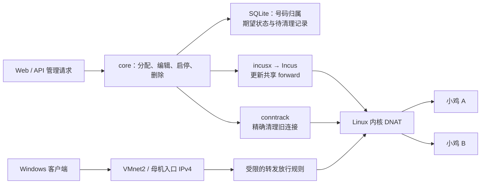

# F03：IPv4 端口分配、转发与清理

日期：2026-09-11。当前批次完成了共享 IPv4 转发、端口追加/目标编辑、生命周期相关清理、页面状态和本地实机检查。它不代表全部 81 项验收完成；A32 中的重装仍依赖尚未实现的 F06。Comet 正式验收数字保持原记录，本文件记录本批开发检查和实测证据。

## 用户现在可以做什么

实验母机的面板已更新，入口仍为 `http://10.90.0.10:8792/`。实例详情提供端口追加、目标编辑、重新应用以及失败状态提示。新建实验小鸡默认使用入口 `10.90.0.11`，`10.90.0.12` 也已纳入可选 IPv4 池。已有实例的地址和端口归属没有迁移；原有小鸡仍在运行，其历史网络记录需先核对，不能据本批的新建实例测试宣称旧映射已生效。

母机的三个 IPv4 与两个 IPv6 实验网段见 [网络环境记录](../development/network-lab.md)。这些都是本地实验资源，不是公网地址，也没有因此实现指定出口 SNAT、NAT66 或面板自动分配 IPv6。

## 重要技术与实际行为

**DNAT 是把入口改写为目标。** 例如访问母机的 `10.90.0.11:30020`，Linux 将目标改为某台小鸡的内部地址和 22 端口。数据直接经过内核，Agent 负责设置规则。实测暂停候选 Agent 时，已有两条 UDP 流仍然畅通，说明转发不依赖 Agent 逐包复制数据。

**Incus 的 forward 是按入口 IP 保存的整张表。** 同一 IP 的多台小鸡必须共用一个对象。现在每条规则标记实例归属，修改或删除只替换本实例的部分，保留同一数据库管理的其他实例规则。最后一台删除后，程序保留没有端口和默认目标的空对象；它没有端口 DNAT 规则，也不继续占用号码。本次测试结束时额外清除了测试专用的空对象。

**版本号不一定等于并发保护。** 对真实 Incus 6.0.4 的专属空对象发送错误 `If-Match`，PUT 仍返回 HTTP 200 并修改了对象。固定版本的 [服务端实现](https://github.com/lxc/incus/blob/v6.0.4/cmd/incusd/network_forwards.go#L564)也未检查该头。因此实现采用单数据库归属和写前记录；拒绝接管外部对象，也拒绝修改混入外部规则的对象。仍发送 `If-Match` 以兼容支持条件更新的后端，但不将它算作当前 Incus 的并发保证。

**写前记录防止把“没收到结果”当作“没有发生”。** 操作 forward 前，先按网络和入口 IP 保存 `forward_writes`，再发送请求。传输中断或进程退出后，这个记录会阻止同一入口上的其他实例继续改表或回收资源。`agent.lock` 则防止同一数据目录同时启动两个 Agent。电源操作在发送前也设置结果未确认的保护，确认终态后才允许恢复转发。

**conntrack 是 Linux 对连接的记忆。** 删除 NAT 规则不一定删除旧连接的转换关系。因此清理顺序为：保存状态、摘除本实例规则、精确删除并核对相关 NAT 连接、停止/删除实例、确认实例不存在，最后在一个数据库事务里释放号码。清理失败时保留占用和错误。

目标编辑保存旧连接的返回地址和返回端口，仅清理旧目标的连接；新目标收到的流量不会被误判为旧连接。恢复映射还会处理停机期间形成的、返回地址指向母机自身的非 NAT 记录。实测发现忽略后一种记录会导致“TCP 已恢复，但持续发送的旧 UDP 客户端一直不通”。修复后，原 UDP socket 无需更换源端口即可恢复。

**DHCP 动态地址不能在停机后继续当作归属证明。** 停机时保留端口账本和自定义目标，但停用实际 DNAT；启动后使用观察到的地址重新绑定。运行中观察到 IPv4 消失时暂停映射，地址恢复后重绑。首次创建在分配锁之外最多等待 45 秒取得地址；普通同步/启动最多等待约 30 秒。超时会如实显示等待状态，而不是编造地址。

**宿主服务占用也要检查。** 自动分配同时检查账本、Incus 规则和母机 IPv4/IPv6 的 TCP/UDP socket，并在应用前复查。TCP 不只检查 LISTEN，也计入监听器关闭后仍然存活的已接受连接及 TIME_WAIT，防止占用号码或连接清理误伤宿主服务。

## 关键代码地图

| 文件 | 职责与关键入口 | 执行关系和当前状态 |
| --- | --- | --- |
| `internal/core/allocation.go` | `reserveInstance`：选择完整号段、检查外部占用、一次事务预留实例及 TCP/UDP | 核心分配；并发保护和写入回滚有回归检查 |
| `internal/core/ports.go` | `AddPort`、`EditPort`、`readHostPortsAt`：追加/指定、编辑目标、检查宿主占用 | 核心规则；先保存期望配置，再调用转发同步；失败保留可核对状态 |
| `internal/core/forwards.go` | `updateInstanceForward`、`syncPortsLocked`、`refreshForwardAddress` | 核心协调：归属验证、共享地址写前记录、保留其他实例、写入回读、等待地址与重绑 |
| `internal/core/conntrack.go` | `changedForwardPorts`、`clearNATConnectionsWith`、`flushConntrackCleanupMode` | 真正影响旧连接的清理；持久队列按入口/协议/号码及旧返回目标过滤，检查清理结果 |
| `internal/core/instances.go` | `runCreateItem`、`Power`、`DeleteInstance`、状态查询 | 创建、启停、删除必须与映射保持一致，因此该文件整体修改；重装明确拒绝且不先停机，仍未实现 |
| `internal/core/app.go`、`lock_linux.go` | 数据目录互斥、采样触发地址重绑、关闭采样后释放目录锁 | 支撑唯一写者和生命周期；不是完整的持久任务执行器 |
| `internal/incusx/forwards.go`、`client.go` | forward 读写、结构化 HTTP 错误、电源操作终态 | Incus 协议封装；内核 DNAT 仍由 Incus 执行，不能用封装函数存在代替实际效果 |
| `internal/store/store.go` | `instance_network`、`forward_writes`、`conntrack_cleanup` 和号码归属触发器 | 持久状态；兼容已有清理队列的增列迁移；同一号码的 TCP/UDP 不能分给不同实例 |
| `internal/api/server.go`、`docs/api/openapi.yaml` | 追加、编辑、同步三个管理接口 | 均经过管理权限和会话来源检查；错误返回也可能已保存分配，需读取最新状态 |
| `web/src/components/instance/Port*.vue`、`usePortActions.ts` | 表格、输入、操作、状态展示 | 核心界面；变更后等待新 GET，失败时不保留旧的“已应用”或 SSH 标记；支持只读刷新 |
| `tests/netprobe/` | 临时 TCP/UDP 服务与保持 UDP socket 的客户端 | 实机检查工具，不是业务代理或 SSH 服务 |
| `deploy/lab/` | VMnet2 实验链路的有限放行与持久化 | 只适用于记录中的实验网卡和地址，不是生产防火墙方案 |



## 检查与实测

| 检查 | 真实结果与范围 |
| --- | --- |
| Go 开发期回归 | Linux 执行 79 个顶层测试通过：core 48、incusx 13、store 2、api 4、cgroupcap 1、cpu 6、hostmetrics 3、sample 2；另有 1 个可选 Incus 检查跳过 |
| Vue 行为 | 16 项通过，包括路由迟到响应、修改后刷新延迟/失败、未确认状态、号码/协议参数与只读刷新 |
| 静态与构建 | Linux `go vet ./...`、Vue 类型检查与 Vite 构建、Linux Agent 构建通过；Windows 没有执行 Go 测试程序 |
| 共享入口 | A、B 同时使用 `10.90.0.11`，各自 20 个号码、40 条 TCP/UDP 规则；Windows TCP/UDP 均到达正确实例 |
| 默认目标 | 首个 TCP 到小鸡 22，UDP 和其余号码同号；用探针核对实际目标，并非 SSH 身份登录测试 |
| 追加和编辑 | 手动追加 30100、自动追加 30040；TCP/UDP 实际可达。持续 UDP 中修改 A 的目标成功，B 的原连接保持正常 |
| 停止与恢复 | A 的 22 个号码和编辑后的目标保持不变；停止后 A 不可达、B 可达；恢复且探针就绪后，A 的原 UDP socket 恢复，源端口仍为 60682 |
| 删除隔离 | 删除 A 后其号码释放、旧 DNAT 连接清零；B 的 40 条规则逐项不变，原 UDP socket（源端口 60683）和 TCP 继续可用 |
| 最终批量创建 | 修复等待地址窗口后，C、D 的同一批创建均到达 `ok/done`；各获 20 个连续号码，使用 `10.90.0.12`，TCP/UDP 均通过 |
| 回收与不同入口 | C 复用了 A 已释放的 30020–30039；入口为 `.12`，旧 `.11:30020` 仍不可达，没有被导向 C |
| 真实宿主冲突 | 临时宿主监听 30060，指定该号码被拒绝；自动分配跳到 30061，TCP/UDP 成对归 C，实际转发通过 |
| 真实外部归属 | 临时外部 forward 占用 `.10` 后，创建在预留前被拒绝；外部对象保持原样，随后清理测试对象 |
| 故障保护 | 自动化故障注入覆盖清理失败、假成功、DB 回滚、读回失败、写前中断、共享地址屏障、电源超时、地址丢失、旧目标与非 NAT 连接清理；没有把模拟故障称为生产故障演练 |
| 测试收尾 | 四台临时小鸡、测试项目/镜像、探针进程/客户端和测试 forward 对象已清理；测试实例、号码及两类待处理队列均为 0 |
| 安装后 | 正式实验服务的实际运行二进制哈希已核对；管理员登录/API 检查通过，原有小鸡仍运行；面板 IPv4/IPv6 页面均 HTTP 200。未进行真实浏览器点击/视觉验收 |

测试期间有过两个需要区分的失败：初版地址等待窗口过短，任务先失败后才取得 DHCP 地址，已修复并以最终双实例批次重测；大文件传输曾超时，不完整文件造成临时测试服务启动异常。后续改用压缩临时文件，先校验压缩包和解压后二进制，再原子替换，最终运行进程的哈希也另行核对。探针必须先确认所有端口就绪，再判断恢复后的 UDP 结果，不能把探针启动间隙的单个丢包当成服务已稳定。

仓库保留了可读取的 [单元检查结果](evidence/f03-2026-09-11/unit-results.json)、[真实 ETag 探测](evidence/f03-2026-09-11/etag-probe.json)、[最终创建批次](evidence/f03-2026-09-11/final-create-summary.json)、[宿主冲突](evidence/f03-2026-09-11/host-conflict-result.json)、[测试清理](evidence/f03-2026-09-11/cleanup-result.json)和 [安装后检查](evidence/f03-2026-09-11/installed-result.json)。这些摘要不包含密码、会话或 API Token。

最终安装使用 Go 1.26.6、`linux/amd64`、`CGO_ENABLED=0`，构建参数含 `-trimpath -ldflags='-s -w'`。运行二进制 SHA-256：

```text
2b139e759eaa0c068d7c62eb76c6aa5a6d040ecc6e8b9a899a48a4aa6c1a1bac
```

更新前的二进制、配置和数据备份在母机 `/root/particeps-backups/f03-20260911/`，目录权限 0700；实际未执行回滚演练。开发检查日志与阶段性实测结果保留在母机 `/tmp/particeps-f03-tests-20260911/`，临时状态库保留为仅 root 可访问的检查材料，对应服务已经停止。

## 当前限制与下一批

- 外部工具不得同时改写已归属 Agent 的 forward；当前 Incus 不提供本批可依赖的 CAS。这是使用边界，不是完整多写者协调。
- 不明写入/电源操作会保留资源并阻止危险重试，尚无人工恢复界面；这与完整任务恢复一并进入 F02/F06。
- 手工绕过 Agent 改 IP/启停时，重绑依赖周期观察，存在采样间隔；不等于即时隔离或防伪造地址。完整租户网络隔离仍未验收。
- 停机保留分配与用户目标，暂停实际规则；重装仍未实现，A32 不能整体标为通过。
- 仍未实现指定 IPv4 出口 SNAT、独立 IPv4、NAT66、完整 IPv6 分配；没有公网连通、8–16 台规模、压力或竞态检测结论。
- 本批只验证映射到 22 的 TCP 路径，没有证明 SSH 服务安装、密码/公钥策略和实际 SSH 登录完整可用。

下一批先做 F05 的 CPU 父/子上限实测，再分别做内存、磁盘和带宽；每种资源保留独立证据。网络和任务的剩余能力按功能批次继续处理。
