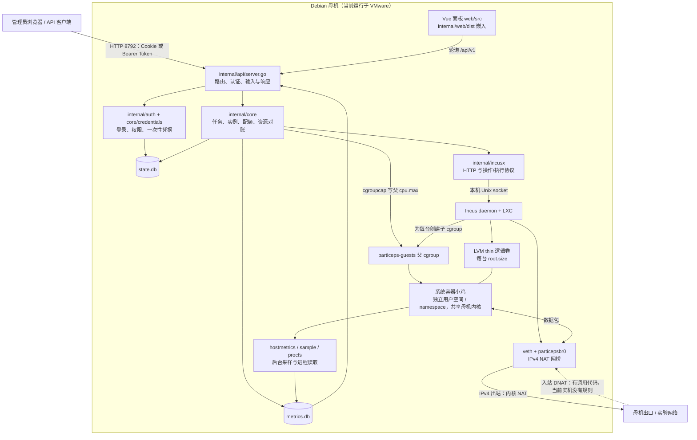

# Particeps 阶段性技术审阅（2026-09-11）

## 1. 当前阶段结论

Particeps 已有一个能够构建、具有真实 Incus 调用与部分运行证据的母机 Agent 原型，正在补齐可靠性。当前还不满足既定全部功能验收，也不适合据此承诺公网、多租户或 8–16 台稳定运行。核心业务代码、协议封装、界面字段和规格目标必须分开判断。

本次核对了当前源码、Git、README/docs、测试产物及现有 Debian VM。报告中的“代码已实现”表示存在相应执行逻辑；“实机读取”只表示观察到指定配置或状态；“测试通过”仅覆盖所列场景。计划中的能力明确列为缺口。

正式进度以 [comet-state.yaml](../comet/changes/particeps-foundation/comet-state.yaml) 为准：`particeps-foundation`，Build，修复第 2 轮，状态版本 20；历史验收 **17 passed / 56 failed / 8 blocked，共 81 项**。这些数字不是本次的新通过数，也不是可以直接换算的开发完成率。本次没有推进正式 Verify 或 Archive。

验收已按功能分为 8 批，每个 ID 恰好出现一次；批次、证据和下一步见 [功能检查记录](functional-audit.md)。正式 brief/spec 中仍有“等待 Shape、尚未业务实现”的旧叙述，与当前状态不符，应作为文档债处理，不能据此否定已经存在的代码，也不能用规格描述证明能力完成。

## 2. 仓库、目录与交付边界

### Git 实际状态

审阅开始时，本地已初始化为 `main`，没有本地提交，应用文件全部未跟踪，未配置 remote。读取用户指定的 GitHub 仓库发现远程 `main` 有一个 `7116571775d1cf016440cfcb47f6ddfd5b4e4512`（`Initial commit`），仅包含 GPL-3.0 LICENSE。

已把 `origin` 配置为 `https://github.com/TXL-325/particeps.git`，fetch 后保留该远程提交为本地历史基线，恢复 LICENSE，设置 `main` 跟踪 `origin/main`。没有覆盖应用文件、改写远程历史或推送。后续本地提交按文件与模块组织，见末节。

| 路径 | 实际职责与纳入版本控制的范围 |
| --- | --- |
| `cmd/particeps-agent/main.go` | 唯一可执行入口；此前被错误的忽略规则漏掉，本轮修复 |
| `internal/` | Go 实现与回归测试；含业务核心、Incus 协议、认证、存储、配额、采样与静态资源嵌入 |
| `web/` | Vue/TypeScript 源码、依赖锁文件、编译配置与组件行为测试 |
| `internal/web/dist/` | Vite 输出，随 Go 二进制嵌入；保留提交，确保源码快照可以构建；前端改动应同时更新它 |
| `deploy/` | Debian 实验安装脚本、示例配置、systemd 服务 |
| `docs/api/` | OpenAPI 草稿，目前远未覆盖全部路由与数据结构 |
| `docs/comet/`、`.comet/config.yaml` | 已确认目标、正式进度与历史验收；不是运行中的 Agent 数据 |
| `.agents/`、`.claude/`、`.codex/`、根目录工具入口文档 | 本机开发接入，包含重复的工作流包装与绝对路径；保留本地，明确忽略 |
| `dist/`、`web/node_modules/`、其余 `.comet/*` | 构建/测试产物、第三方安装内容与本机流程数据，忽略 |

当前应用共 38 个 Go 源文件（含测试）和 14 个 Vue 组件。目录层次总体够用，真正的维护压力集中在 `core/instances.go` 和 `core/app.go`，而非目录数量。

### `.gitignore` 与敏感文件

原规则 `particeps-agent` 会匹配任意层级同名目录，因此把整个 `cmd/particeps-agent/` 隐藏了。已改成仅匹配仓库根目录的 `/particeps-agent`，入口源码可以正常提交。新增数据库及 WAL/SHM、私钥、`.env`、初始管理员密码、凭据密钥与本地备份排除；`.gitattributes` 统一文本 LF，安装脚本实际也已检查为 LF。

检查了应用文件及本地工具文本的敏感文件名、私钥头、常见 Token 格式、URL 内嵌凭据和明文字面赋值。未发现真实运行密码、私钥或访问 Token；命中均为 `credentials_test.go` 和 Vue 行为测试中的固定测试数据。测试字符串没有连接真实账户。每个提交都另行核对了暂存内容，不依赖 `.gitignore` 代替检查。

默认运行数据在 `/var/lib/particeps/`：`state.db`、`metrics.db`、`credential.key`、`admin-bootstrap.txt` 都不应进入仓库。首次密码文件和加密密钥需按运行凭据保护；加密数据库字段并不能保护同时泄露的数据库和密钥。原有根目录 `package-lock.json` 没有对应 `package.json` 且内容为空包集合，已移除；实际前端锁文件仍为 `web/package-lock.json`。

## 3. 实机状态与整体架构

### 已读取的实验环境

| 项目 | 观察结果 | 可以与不可以据此证明什么 |
| --- | --- | --- |
| 母机 | Debian 13.6，内核 `6.12.107+deb13-amd64`，VMware，2 vCPU，MemTotal 3977120 kB，约 50 GB 根盘 | 是 Linux VM 实验母机；不是裸金属容量或公网性能证明 |
| 服务 | Incus 6.0.4；旧 Agent active/running，用户 root，监听 `*:8792` | 确认服务与暴露地址；当前示例的 localhost 默认值并未应用到旧服务 |
| 小鸡 | 1 台运行中的 Alpine 系统容器，`p-911f4462a5e2` | 不代表 Debian 模板或 8–16 台验证通过 |
| 用户隔离 | 容器进程 uid_map 为 `0 → 1000000` 起始映射 | 当前容器是非特权用户映射；容器内 root 不直接等同母机 UID 0 |
| namespace | 母机与容器进程的 net namespace 标识不同 | 网络栈隔离存在；不能推出同一网桥上的租户互访已被禁止 |
| CPU/内存 | 父 `cpu.max=150000 100000`；子 `50000 100000`；子 `memory.max=134217728`、`memory.swap.max=0` | 有真实内核限额与层级；没有做持续压力、OOM 或同时满载验证 |
| 存储 | loop 文件支撑的约 16 GiB LVM thin pool；容器 LV 1073741824 字节，容器 `df` 可见约 946072 KiB 文件系统 | 卷确实存在；文件系统容量扣除元数据后小于标称 1 GiB；没有做写满/扩容/池耗尽验证 |
| IPv4 | `particepsbr0=10.80.0.1/24`，`ipv4.nat=true`，内核转发开启，默认出口为实验私网网卡 | 基础 NAT 配置存在；当前网络 forward 列表为 **空**，不能宣称 SSH 端口映射已可用 |
| IPv6 | 网桥 `ipv6.address=none`，内核 IPv6 转发为 0，无 IPv6 默认路由 | 当前环境与代码都不足以验证 NAT66、独立 IPv6 或双栈 |

测试母机现有二进制 SHA-256 为 `bef0f26768f5edc65c9961dca1cab75048ff7ef7c50165b407c6c449039422d0`。本轮候选产物为 `ebc43a0e586d73e6a6c9d64850219606aa83e2f6adb5a192f2758beaf28f4864`，仅放到测试临时目录供读取与扫描，**未替换正在运行的服务**。

### 架构与代码关系图



Web 面板和 API 都由同一个 Agent 提供。当前没有另外的远程控制服务、Agent 注册/心跳或多母机汇报通道；外部程序是直接携带 Token 调用本机 API。图中的 `incusx` 是操作 Incus 的客户端，实际创建容器、虚拟网卡和磁盘的是 Incus/LXC 与 Linux 内核。

## 4. 技术选型，用通俗语言理解

| 技术 | 它是什么、为什么需要 | 在 Particeps 中的实现与限制 |
| --- | --- | --- |
| Linux 内核 | 管理 CPU、内存、进程和网络的底层系统 | 母机与所有系统容器共享同一个内核；没有给每台小鸡装一个独立内核，内核漏洞与资源争用属于共同风险 |
| VMware 虚拟机 | 用虚拟硬件运行一整套操作系统 | 当前用于在 Windows 环境里运行 Debian 母机；这是实验环境外层，不是 Agent 创建小鸡时调用的后端 |
| Incus + LXC 系统容器 | 让隔离的一组进程运行一套 Linux 用户空间，像一台轻量 Linux 机器 | 创建请求明确为 `type: container`。不是应用镜像只跑一个服务的模式，也没有实现 KVM/QEMU 或 Podman 后端。接口抽象不等于已经支持其他后端 |
| Go | 适合常驻服务、HTTP 与并发任务的编译语言 | `net/http`、goroutine、`embed`；CGO=0 输出 Linux amd64 单文件。语言声明为 Go 1.23，项目默认工具链固定 Go 1.26.6；母机不需要 Go 编译器 |
| Vue 3 + TypeScript | 把数据映射成界面，并约束前端数据类型 | 锁定安装结果：Vue 3.5.42、Router 4.6.4、TypeScript 5.7.3；Composition API，未引入 Pinia。Vite 6.4.3 构建，vue-tsc 2.2.12 校验；界面依赖仍需与后端契约同步 |
| SQLite + WAL | 把数据库保存在本机文件；WAL 允许读者与写者更好地并存 | modernc.org/sqlite 1.38.2，不需要 CGO；状态、指标两份 DB。方便单母机部署，但不是分布式队列，也没有跨 SQLite 与 Incus 的原子事务 |
| systemd | Linux 的服务启动、守护与重启管理器 | 启动 root Agent，故障后重启；没有实现应用级优雅退出、升级回滚或任务自动续跑，进程重启不能代替业务恢复 |
| Unix socket + HTTP | 同一机器中进程通信的文件型入口；HTTP 是其消息格式 | Agent 通过 `/var/lib/incus/unix.socket` 控制 Incus；外部管理另走 HTTP API。socket 权限是敏感边界，获得此能力通常意味着很高的母机控制权限 |

其余关键技术需要放在实际执行流程中理解，见下列代码地图。列出的路径是实现定位，不把整段源码复制成说明。

## 5. 关键代码地图与执行流程

### 5.1 Agent 启动与总装配

**路径：** [cmd/particeps-agent/main.go](../../cmd/particeps-agent/main.go)、[internal/config/config.go](../../internal/config/config.go)、[internal/core/app.go](../../internal/core/app.go)。

**职责与结构：** `main` 是进程入口；`Config` 保存监听、数据库目录、Incus 项目/池/网桥、端口、并发、采样和总 CPU 参数；`App` 组合存储、认证、IncusBackend、采样器、互斥锁和 worker 信号量。

**核心流程：** 读 YAML 默认值 → 可用 `PARTICEPS_LISTEN` 覆盖监听 → `core.Open` 建立两份 DB、迁移、读取保存的 CPU 总帽、应用父 cgroup、创建 Incus 客户端、启动采样 → 首次生成管理员密码文件 → 检查 Incus、确保项目/网桥、恢复期望电源状态 → 挂载 Web/API 并监听。

**模块关系与设计理由：** 配置与进程启动分离，API 使用统一 `App`，便于小型单母机服务部署。`IncusBackend` 把业务与协议边界明确分开，本轮故障注入可以模拟远端失败而不修改真实母机。

**状态：** 这是实际启动核心，已经能构建；读取保存总帽优先于示例默认值，避免重启丢失 Web 设置。

**问题：** `EnsureProject/EnsureNetwork` 的错误被入口忽略；Incus 不可用时 HTTP 仍启动。`http.ListenAndServe` 未配置服务超时，`log.Fatal` 退出不执行 defer；`Close` 关闭 DB 但没有取消采样/任务。`bridgeAddr` 直接把 IPv4 最后一个字节设为 1，只适配默认网段习惯，不能当作任意 CIDR 的正确网关算法。配置缺失会静默采用默认，YAML 未严格拒绝未知字段。

### 5.2 Incus 客户端：封装协议，不实现虚拟化

**路径：** [internal/incusx/client.go](../../internal/incusx/client.go)、[internal/incusx/exec.go](../../internal/incusx/exec.go)、[internal/core/backend.go](../../internal/core/backend.go)。

**职责与结构：** `Client` 管理 HTTP transport 与 project 作用域；`opResp`、`operationResult` 解析响应与异步操作；`InstanceState` 接收运行状态；`ConfigOperation` 记录资源修改的引用和是否终止。

**流程：** `Connect` 把 HTTP 连接拨到 Unix socket；`q` 给实例/网络/镜像请求附加 project；`doContext` 编码请求、限制响应大小、检查 HTTP 与 Incus 错误；创建/启停等调用 `Wait` 检查真正的操作结果。资源改配使用 `BeginConfigUpdate` 先返回引用，由 core 持久化后才等待，恢复时再用 `ConfigOperationFinished` 查终态。

`Exec` 是另一条执行协议：发送命令，必要时连接 stdin/stdout/stderr 三条 WebSocket；密码通过 `chpasswd` 的标准输入传递；读取流结束标记、操作结果和命令退出码。这里的 WebSocket 是 Agent ↔ Incus 通道，**不是已经提供浏览器交互终端**。

**设计理由：** HTTP 成功只说明请求/查询成功，后台操作或命令仍可能失败。本轮修复了“成功响应包里实际失败”“非零退出码被当成功”和未按 WebSocket 协议发送 stdin 的错误。查询参数保留 project 等信息，避免错误地拼接 wait 路径。

**状态与限制：** 是实际使用的基础封装。`CreateInstance` 固定使用远程 simplestreams 镜像源和 `default` profile；本地镜像登记尚未接入。未传 stdin 的 `Exec` 虽检查退出码，但不取回记录的 stdout；不是通用终端接口。客户端整体超时较长，很多业务请求没有把 HTTP 请求取消传递到后端。没有用官方完整 SDK 或 ETag 实现外部并发修改保护。

### 5.3 创建小鸡与批量任务

**路径：** [internal/core/instances.go](../../internal/core/instances.go) 的 `SubmitCreate`、`runCreateItem`、`refreshTask`、`GetTask`；[internal/core/allocation.go](../../internal/core/allocation.go)。

**职责与结构：** `CreateReq` 是创建请求；`Task/TaskItem` 描述批次与单台结果；`Instance` 是管理记录与状态视图。这里是真正决定创建顺序和失败行为的业务核心。

**核心流程：**

1. `SubmitCreate` 校验名称、数量、CPU、绑核、内存、磁盘、带宽和网络模式，补 Alpine/Debian 默认值。
2. 对规范化请求计算摘要；同一 `Idempotency-Key`、同一内容返回已有任务，不同内容拒绝。幂等的含义是“同一个请求重试不会再创建一批”，不是任意重复点击都自动合并。
3. 在一次事务中写入任务及所有 pending 子项，提交之后启动 goroutine。每个 worker 通过 `sem` 取得并发名额，默认最多 2 台同时执行后端创建。
4. worker 生成管理 ID 与 Incus 名，选择地址、密码/公钥配置，调用 `reserveInstance` 预留管理记录和完整端口块。
5. 构造 CPU、内存、root disk、网卡和 `raw.lxc` 配置 → 创建容器 → 启动 → 设置密码/公钥 → 创建转发 → 加密暂存初始凭据 → 标记成功。
6. 失败记录停在相应步骤；`refreshTask` 单条 SQL 从子项实时聚合出 running/ok/partial/failed。

**设计理由与关联：** 持久状态帮助解释异步任务；先落全部子项，防止最早完成的 worker 把尚未登记的批次误判为结束。端口预留由 store 事务保证，实际创建交由 Incus，凭据交给独立凭据模块。

**当前状态：** 创建链路与默认参数已实现且有故障回归；没有把 Linux 命令失败当成成功，也不再通过清除 `raw.lxc` 绕开总帽后重试启动。

**问题：** 等待 semaphore 的 goroutine 数没有全局排队上限；固定 sleep 代替可靠 readiness；任务项写失败多处忽略。失败后没有完整补偿状态机，可能留下管理记录、端口预留或容器。任务记录不等同持久执行器，重启后不会按步骤自动续跑或只重试失败项。池设置可在校验与 worker 真正执行之间变化。Web 每次提交新建幂等键，创建表单的 busy 状态未接入，重复点击仍需修复。

### 5.4 端口分配、映射与释放

**路径：** `core/allocation.go::reserveInstance`、[internal/store/store.go](../../internal/store/store.go) 的 `NextPorts`；`core/instances.go::applyForwards/toForward/DeleteInstance`；`incusx/client.go::CreateForward/DeleteForward`。

**职责：** 把一个宿主入口端口转给某台小鸡，并保证管理记录不会把同一端口随意分给多台。

**流程与设计：** `NextPorts` 寻找连续空号段；`reserveInstance` 在锁内用一次 DB 事务写实例和所有 TCP/UDP 行，任何一行失败全部回滚。默认池 20000–59999、每台 20 个号码，每号 TCP/UDP 都属于同一实例；首个 TCP 指向 22，其余按同号转发。`applyForwards` 读取容器 IPv4，再构造 Incus network forward。

**通俗解释：** 外面访问“母机 IP:20000”，DNAT 把目标改成“小鸡私网 IP:22”。数据库里的 port 行只是分配账本，真正转包要靠 Incus 配置的内核规则，账本存在不说明入口可连。

**已修复：** 连续区间搜索、并发互斥、TCP/UDP 所有权和事务回滚。

**关键缺口：** 多台使用同一公网地址时，当前每台都 POST 新 forward；Incus 的同一监听地址应共用一个 forward 并更新 ports，第二台会发生冲突。删除仍忽略转发清理错误；共用地址还有其他实例时甚至不移除被删实例自己的规则，就释放端口。没有扫描母机监听或其他 Incus forward 冲突，DHCP 地址改变后也不会同步映射。这是下一阶段最应先修的业务闭环之一。

### 5.5 启停、销毁、重装与状态一致性

**路径：** `core/instances.go::Power/DeleteInstance/Rebuild/RestoreDesiredPower`，经 `incusx` 执行真实动作。

**流程：** `Power` 先操作 Incus，成功后记录 `desired_power`；`RestoreDesiredPower` 启动时比较期望值和运行状态。`DeleteInstance` 尝试强停，视共享地址情况尝试删除 forward，再删除容器，最后删除 ports 和 instance 记录。`Rebuild` 先停机，调用 `/instances/{name}/rebuild`，失败时留一条 needs-review 任务。

**为什么需要期望状态：** “我希望它停着”与“现在它是否运行”是不同事实；重启恢复必须同时知道两者，不能只依赖最后一次按钮返回值。

**当前状态：** 普通单台启停/删除已有调用。当前重装只是未闭环的接口尝试，不能当作完整可用的重装实现；没有镜像来源验证、凭据重建、网络资源保留及失败恢复证据。批量生命周期主要是 Web 串行调用，不是后端统一任务。

**风险：** `boot.autostart=true` 与 stopped 的 desired_power 冲突，母机启动可能先把容器启动，再由 Agent 停下。部分“已经运行/停止”的提前返回不更新期望状态。删除/重装的多步动作不具原子性，强停、启动、DB 写失败多处被忽略；没有逐实例操作锁来统一处理同时删除、改配、重装。不能在这些路径完成前把“调用了删除 API”当成资源已安全释放。

### 5.6 CPU 限额与 cgroup 层级

**路径：** [internal/cpu/cpu.go](../../internal/cpu/cpu.go)、[internal/cpu/validate.go](../../internal/cpu/validate.go)、[internal/cgroupcap/cap.go](../../internal/cgroupcap/cap.go)、`core/app.go::SetCPUCap/CPUCapStatus`。

**cgroup 是什么：** Linux 按进程组记账并实施资源限额的机制。父组可以限制全部子组，小鸡自己的子组再限制单台。它不创建 CPU，也不保证独享硬件。

实机读取到的层级是：

```text
/sys/fs/cgroup/
└─ particeps-guests/                         cpu.max = 150000 100000
   └─ lxc.payload.particeps_p-911f4462a5e2/   cpu.max = 50000 100000
                                            memory.max = 134217728
```

`cpu.max` 两个数字的单位是微秒，分别是 quota 和 period。每 100ms 最多消耗 50ms CPU 时间，就是平均 0.5 核；父组 150ms/100ms，就是所有小鸡合计平均 1.5 核。多 CPU 可以并行消耗这个预算，**不是每个 CPU 固定限 75%，也不是容器只“看见半个 CPU”**。短时间可以并行运行，预算耗尽后在周期内被调度器节流。

核心配置只有几项，但决定了资源边界：

```go
"limits.cpu.allowance": cpu.Allowance(req.CPUCores),
"limits.memory":        fmt.Sprintf("%dMiB", req.MemoryMiB),
"raw.lxc":              cgroupcap.LXCRaw(),
```

`Allowance(0.5)` 返回 `50ms/100ms`；`LXCRaw` 要求 LXC 使用 `particeps-guests` 父路径。`Apply` 启用 CPU controller，写父 `cpu.max` 并回读。只看到 `Applied=true` 说明该次父上限写入获确认，不是所有容器成员关系的持续证明。

**绑核：** `limits.cpu` 选择允许在哪些逻辑 CPU 运行，与额度是两回事。Incus 的裸整数表示 CPU 数量，因此选择 CPU 1 要编码为 `1-1`。本轮校验了集合、在线 CPU 和配额不超过集合容量；尚未根据父组 effective cpuset/CPU 热插拔做完整重算。

**超分：** 8 台各配置 0.5 核，账面合计 4 核可以超过 2 核母机；代码用 `4/2=2×` 显示超分。它们实际同时争用时仍受父 1.5 核限制，不能保证每台都取得完整 0.5 核。Agent、Incus 与系统进程不在这个小鸡总帽中。

**失败处理：** 改总帽先检查待对账资源和最大单台额度；内核写入/回读失败就尝试恢复旧值，恢复无法确认则 `Applied=false`，后续预留被阻止。不能保留一个已经失去证据的成功标记。本轮有回归，但仍缺多台负载下的实测和运行期间外部 cgroup 漂移检测。

### 5.7 内存、磁盘、带宽与资源修改事务

**路径：** `core/instances.go::PatchResources`、[internal/core/reconciliation.go](../../internal/core/reconciliation.go)、`store.go::resource_updates`、`incusx::BeginConfigUpdate`。

**内存是什么：** 是进程正在使用的工作空间。`limits.memory` 交由 Incus 转成 cgroup 限额，耗尽可能触发回收或 OOM，应用/SSH 进程可能被杀。代码没有建立所有小鸡的内存总池或可靠的可用容量预留；当前 VM 的 swap.max 为 0 是实机状态，不应推广成所有安装的显式配置保证。

**磁盘是什么：** 是持久文件所在的卷。安装脚本使用 LVM thin：给小鸡一个标称大小的逻辑卷，数据实际写入时才占共享池空间。`root.size=1GiB` 控制容量，和 CPU cgroup、磁盘 IOPS/吞吐限制不是同一功能。当前只允许扩盘，未实现 IO 限速；thin pool 物理空间和元数据耗尽会影响多台小鸡，代码没有相应容量预检/告警。16 GiB 池也不能承诺 16 台 Debian 各自写满 4 GiB。

**带宽是什么：** 每秒通过网卡的数据量。代码给完整 `eth0` 设备设置 `limits.ingress/egress`，由 Incus/内核网络机制执行；0 表示清除该限制。当前没有吞吐实测，纯 IPv6 路径又没有完成网卡设置，不能把数据库中的 Mbps 当成实际限速证明。

**改配执行流程：** 在资源锁内先对账已有未完成修改 → 校验整个请求（包括禁止缩盘）→ 读取 Incus 配置并保留完整 root/eth0 设备属性 → 先把 Before/After 意图写入 DB → 发起修改并持久化 operation ID → 等到明确终态 → 读回各目标字段 → 在同一事务更新资源记录并删除待对账标记。

**为什么不能只改数据库：** SQLite 与 Incus 没有共同事务，可能出现远端已改、DB 写失败，也可能请求超时而远端仍继续。`resource_updates` 保存这种不确定性，列表显示 `needs-reconciliation`。后续改配、总帽与预留先检查它，防止旧 CPU 记录允许一个过低的父上限。

**关键修复：** 一次读到 Before 或 After 都不足以证明先前操作结束；必须先确认 Incus operation 的 200/400/401 终态。操作仍运行、引用未知或查询失败时继续阻止修改。终态确认后配置与 Before/After 均不匹配，说明部分应用或漂移，仍需处理。

**限制：** 无 operation 引用、引用已被清理或永久混合配置时，没有管理界面引导恢复；当前策略偏向保留安全阻塞。回读验证的是 Incus 配置，不能代替来宾文件系统扩容、流量速率或负载实测。直接由其他工具改 Incus/cgroup 的行为也没有统一持续协调。

### 5.8 network namespace、虚拟网卡与地址池

**路径：** [internal/netdetect/detect.go](../../internal/netdetect/detect.go)、`core/app.go::Pool/SetPool`、`core/instances.go::defaultStack/validateStack/runCreateItem`、`incusx/client.go::EnsureNetwork`。

**通俗解释：** network namespace 给容器一套自己的接口、路由表与端口空间；veth 像一根有两端的虚拟网线，一端在小鸡，一端接母机 bridge（虚拟交换机）。Incus 创建这些对象，Particeps 只提供设备配置。网络 namespace 分开不等于交换机上的小鸡不能互相通信。

**实际流程：** `EnsureNetwork` 创建 IPv4 bridge，开启 `ipv4.nat`，关闭 IPv6 地址；v4/dual 的创建配置把 eth0 接到此网桥。`Scan` 枚举网卡地址并过滤部分虚拟/环回接口，给 Web 候选；管理员勾选后 `SetPool` 仅把 JSON 存到 settings。

**选型理由：** 让成熟的 Incus 管理 bridge、DHCP 和内核转发，避免 Agent 自己为每条连接做代理。数据包不需要绕经 Go 进程，CPU 带宽和端口规则可以留在内核。

**限制：** 检测到一个地址不等于有权把它分配给小鸡，也不证明公网可达。`SetPool` 未用 `net/netip` 检查格式、重复、family、归属和分配冲突；候选里仍可能有实验私网 IP。未配置租户 ACL、反 MAC/IP 欺骗、源地址控制等策略，默认同一 bridge 的隔离不满足严格多租户安全要求。`SourceIPLimit` 已有字段，但没有执行限额的规则。

### 5.9 IPv4 NAT、SNAT、DNAT、IPv6 NAT66 与前缀

**路径：** `core/instances.go::applyForwards/toForward/assignFromPrefix`、`incusx::EnsureNetwork/CreateForward`、`PoolSettings`、`NetworkPoolSettings.vue`。

| 概念 | 通俗含义与用途 | 目前做到了什么 |
| --- | --- | --- |
| IPv4 NAT | 私网地址与母机外部地址之间做转换，让多台共用有限 IPv4 | 网桥启用了 Incus IPv4 NAT；实验母机本身又位于 VMware 私网，不能直接推导公网访问 |
| SNAT / masquerade | 出门时改源地址，让回包能返回母机 | 默认 bridge NAT 会做相应出站转换；`natIPv4` 当前主要用于 forward 监听，代码没有把管理员选中的地址强制设为实际 SNAT 源地址 |
| DNAT / 端口映射 | 进门时按母机端口找到对应小鸡和端口 | 有构造 forward 的代码；共享监听地址更新与清理有缺陷，当前实机无规则 |
| 独立 IPv4 | 一台小鸡有自己的外部 IPv4，不靠共享端口区分 | `dedicated_ipv4` / `DedicatedV4` 只是记录字段；没有完整分配、NIC、路由或 ARP 配置 |
| IPv6 NAT66 | IPv6 地址之间做源/目的转换，可共享一个 IPv6 的端口 | 有模式字符串和输入框，没有 IPv6 私网 NIC、默认路由、SNAT/DNAT 内核规则。不能宣称已支持 |
| IPv6 前缀直路由 | 从一段地址中为每台取独立地址，上游把该段路由到母机，再由母机送到小鸡 | 候选前缀与字符串分配函数存在；地址写入网卡、路由/NDP、冲突检查、上游可用性验证均未完成 |

IPv6 前缀中的 `/64` 表示前 64 位用于网络部分，并不是“网卡上显示一个 /64，就自动能把里面所有地址发给别人”。还需要上游允许并路由该网段，或者正确处理邻居发现。

当前 `assignFromPrefix` 把前缀去掉斜杠和末尾冒号，再拼 ID 前四位。输入 `2001:db8::/64` 会得到类似 `2001:db8:abcd`，它不是合法完整 IPv6；只用 16 位后缀也没有排重。应改为解析前缀、按位生成合法地址、持久化分配与排重，再落实路由，不能只修一下字符串展示。

`v6` 创建路径甚至不构造 eth0；当前项目 default profile 的 devices 也是空的。`dual` 只添加原来的 IPv4 NIC，并未应用记录的 IPv6。所以这些模式字段反映目标选择，尚不决定真实双栈连通性。

### 5.10 状态数据库、事务与恢复

**路径：** `internal/store/store.go`、`core/reconciliation.go`、`core/credentials.go`、`core/metrics.go`。

**结构：** state DB 包含管理员/会话/Token、settings、instances、ports、tasks/task_items、resource_updates、images、traffic。metrics DB 保存 samples；目前复用了 `store.Open`，因此还会建一套不需要的业务表，这是模块边界上的技术债。

**核心机制：** WAL、busy timeout、外键、唯一约束及显式事务。端口唯一约束约束地址/协议/号码；创建幂等键唯一；预留整体回滚；资源对账和一次性领取用事务收尾。SQL 值使用参数绑定，避免把请求值拼成 SQL。

**为什么这样设计：** 单母机部署用文件数据库简单；持久化可以在进程故障后保留“发生过什么”。但数据库事务只能保护数据库里的步骤；容器启动、转发和磁盘修改仍要有额外操作状态与补偿机制。

**当前限制：** 创建任务恢复、删除状态机、周期流量表尚未闭环；`traffic` 的存在不表示已累计流量。多处 `_ =` 忽略读写失败，部分迭代未检查 `rows.Err()`。没有明确 schema version、通用迁移/备份回滚方案；凭据旧字段清除不等于 WAL、备份或磁盘介质上的安全擦除。

### 5.11 监控、历史和小鸡进程

**路径：** [internal/hostmetrics/host.go](../../internal/hostmetrics/host.go)、`disk_linux.go`、[internal/sample/sample.go](../../internal/sample/sample.go)、`core/app.go::collectLoop/sampleOnce`、`core/instances.go::Series`、[internal/procfs/guest.go](../../internal/procfs/guest.go)。

**概念：** `/proc` 是 Linux 提供的运行状态视图。CPU 与网卡统计通常是“自启动以来累加的计数”，速度/使用核数必须取两次差值再除以真实时间，不能把一个累计值直接叫实时用量。

**流程：** 后台每 5 秒读取宿主 `/proc/stat`、`meminfo`、`net/dev` 和文件系统容量；从 Incus state 读取小鸡 CPU 纳秒数、网卡字节数，计算增量写入 samples。API 读取缓存/历史，浏览器刷新不会改变采样基线。`Series` 使用采样时保存的 quota 计算历史使用比例，避免调大配额后把过去曲线一起改写。

**质量处理：** first/missing/reset 与 ok 区分；宿主 CPU 和网络分别判断质量，网卡缺失不会让有效 CPU 变成 0。网络缺测存 NULL，前端显示破折号，CPU 图在无效点断开。客户看到的“没有数据”与“真的零流量”应是不同事实。

**进程诊断：** `GuestProcs` 经 `/proc/<容器宿主PID>/root/proc` 读取对应来宾进程的 stat/status，给出 PID、UID、状态、RSS。CPU 当前为 `(utime+stime)/100` 的累计秒数，前端已改成相符标签；尚未通过两次采样算实时百分比，也未校验时钟频率、PID 生命周期或提供完整错误原因。

**限制：** 原始样本只保留 24 小时，没有分钟汇总/30 天历史、周期流量、完整网络图和诊断排序。列表和详情反复顺序查询 Incus，`GetInstance` 甚至先取全部实例，形成 N+1 查询；多页/多用户会放大调用量。默认上联只查 IPv4 默认路由，纯 IPv6 或换网卡时可能缺测。采样 goroutine 无退出信号，删除实例后缓存也未回收。未运行 race detector。

### 5.12 API、安全控制与一次性凭据

**路径：** [internal/api/server.go](../../internal/api/server.go)、[internal/auth/auth.go](../../internal/auth/auth.go)、[internal/core/credentials.go](../../internal/core/credentials.go)。

**职责与核心结构：** `Server.Handler` 用 HTTP method + path 注册路由，认证包装区分读取与管理；`Principal` 表示 admin/read/manage 权限及来自 session 或 Token；凭据模块管理密钥、密文和领取。

**认证流程：** 管理员密码通过 bcrypt 保存校验值；登录成功写 12 小时会话，Cookie 为 HttpOnly/SameSite Strict；Token 随机生成，只保存 SHA-256 摘要，可撤销。Bearer Token 不依赖浏览器 Cookie；read 权限不能调用管理写入或领取初始密码。

**输入与输出：** JSON 限制 1 MiB、必须单对象、拒绝未知字段和尾随对象；会话写入及登录/退出做 Origin/Fetch-Site 检查；JSON 响应加 no-store/nosniff。它们降低误解析、跨站请求和凭据缓存风险，但不是完整安全体系。

**一次性凭据流程：** AES-GCM 使用本机随机密钥与 nonce 加密初始密码，并绑定任务/实例身份；15 分钟内管理端可领取，事务清除 result_json 后才返回。普通任务查询仅给 `credentialAvailable`。网络丢失导致领取响应丢失时不会再暴露原密码，应走密码重置。

**限制与风险：** 没有登录速率限制、管理审计日志、细粒度实例授权和请求超时；TLS 需外层部署，反向代理终止 TLS 时 `r.TLS` 为 nil，Cookie Secure 的处理还未完善。服务运行 root，`NoNewPrivileges` 不会撤掉现有 root 权限；API 被攻破的影响很大。首次密码文件没有自动销毁，Token 没有过期机制，历史会话和过期密文缺少清理。关闭 `passwordLogin` 只改变初始化分支，未明确修改 sshd 的密码认证设置；不能当作已禁用 SSH 密码登录。

### 5.13 前端数据流、身份与界面缺口

**路径：** `web/src/main.ts`、`api.ts`、`composables/usePollingResource.ts`、`useInstanceDetail.ts`、`useTaskDetails.ts`，以及各 views/components。

**流程与设计：** Router 选择列表、详情、任务和设置页；api.ts 封装 fetch；通用轮询用 AbortController、递增 generation 和请求 key 三重检查阻止旧响应覆盖新页面，并在隐藏/卸载时取消。详情页的操作捕获当前实例身份，显示失败；进程响应还要核对规范 ID，名称路由先解析 ID。任务凭据按 instanceId 合并，清除显示会使在途领取失效。

**为何重要：** 切换 A → B 时，A 的慢响应不能把 B 页面变成 A，更不能误导后续管理操作；一次性密码也不能因晚响应重新出现或被下一批覆盖。

**当前状态：** 上述修复有真实 Vue runtime/SSR 回归，而不是只检索源文本。图表处理空/null 集合、真实时间坐标和历史配额。组件边界比后端核心更清楚，但 API 类型目前手写，OpenAPI 没有生成契约。

**缺口：** 创建 busy 未接入；设置页缺少统一错误显示和请求串行/版本保护；批量操作失败后中断，没有逐项结果；本地镜像、重装、绑核/资源编辑、端口编辑、Web 终端和 Token 撤销的界面不完整。前端测试通过不等于浏览器布局、所有按钮或真实后端交互已验收。

### 5.14 安装与升级

**路径：** [deploy/install.sh](../../deploy/install.sh)、[deploy/particeps-agent.service](../../deploy/particeps-agent.service)、[deploy/config.yaml](../../deploy/config.yaml)。

**流程：** 检查架构/版本字符串与根盘空闲 → apt 安装 Incus/LVM → 启动 Incus → 创建或复用固定名称的 pool/bridge/project → 安装二进制与首次配置 → 写 cgroup 初值 → enable/start Agent。

**通俗解释与选型理由：** LVM 管磁盘，bridge 管网络，systemd 管进程；脚本把这些独立的系统组件装配到一台实验母机上，Agent 才有可调用的基础设施。

**实际状态：** 有可阅读的安装流程，shell 语法检查通过。当前 VM 的资源与该方案相符，但本轮没有重新执行脚本；不能把过去存在的服务当成当前脚本的安装/升级验证。

**风险：** 同名就复用，没有归属/类型检查；固定网段没有重叠检查；没有安装包哈希/签名、旧版备份和回滚；启动前的多个宿主操作没有统一补偿。脚本仍硬编码写 1.5 核且忽略错误，重跑时可能干扰保存的总帽；`systemctl enable --now` 也不保证已运行服务载入新二进制。输入包校验应在系统修改之前完成。需要独立补齐升级流程，不能简单重复安装命令作为升级承诺。

## 6. 本轮修复与仍存在的技术债

本轮已落实的重点是：Incus 异步/命令结果判断、标准输入协议、禁止去掉 cgroup 绕过启动失败、资源整体验证和设备保留、操作引用/终态/读回的持久对账、父总帽失败恢复、连续端口的事务预留、任务汇总并发修复、初始凭据保密与一次领取、JSON/来源检查、采样质量与前端请求身份保护、构建工具链安全修复，以及仓库入口漏跟踪修复。

结构改进应围绕行为边界推进，而不是为增加目录或拆 commit 改造代码。`core/instances.go` 同时包含创建、网络、生命周期、资源、镜像、Token 和历史查询；`core/app.go` 同时承担启动、配置与采样。现在的接口层次可以支撑原型，后续应逐步把任务执行器、网络资源管理和生命周期恢复分开。`Instance` 混合数据库实体与实时 DTO，重复读取、空值质量和错误映射难以统一。

较小的重复包括两处 `itoa`、与数据库/客户端散落的状态转换、未被充分使用的类型/辅助函数。它们的优先级低于状态机和网络安全，不应先做大规模“美化式重构”。

## 7. 安全与验证结果

Go 1.26.4 的旧 Agent 和本轮最初构建均在二进制符号扫描中命中 6 项标准库公告：`GO-2026-6218`、`GO-2026-6090`、`GO-2026-6089`、`GO-2026-5972`、`GO-2026-5856`、`GO-2026-5026`，涉及 URL 处理、TLS、HTTP 与 ASN.1。公告可按编号在 `https://pkg.go.dev/vuln/` 查询。符号命中不是已经遭到利用的证明，也不能省略具体部署暴露面的判断。

项目已增加 `toolchain go1.26.6` 并用该版本重新 vet、构建和测试。新候选 `govulncheck -mode=binary` 退出 0，当前二进制符号命中为 0；工具另报依赖模块中 20 项公告，但未发现当前代码调用对应漏洞。`npm audit` 为 0 项。以上都是本次公告库快照，不能表述成“系统完全安全”。虚拟机上的旧服务没有部署更新，仍保留旧扫描结果与 `*:8792` 监听状态。

开发期验证为：8 个 Go 包的 42 个顶层测试全部通过；真实 Incus 只读检查单独 1 项通过；Vue 行为/SSR 10 项通过；vue-tsc/Vite 构建、Linux Agent 构建、Linux 目标 go vet 和安装脚本语法检查通过。前后端指定修复均经过独立只读复核。

未验证：8–16 台创建与并发压力、CPU/内存/磁盘/带宽的负载边界、SSH 密钥/密码登录、公网双向连通、IPv6/NAT66、销毁/重装/升级恢复、真实浏览器视觉、race detector。测试包数量和用例数不能替代这些证据。详细测试组成见 [功能检查记录](functional-audit.md)。

## 8. 最重要的问题与下一阶段优先级

| 优先级 | 问题与代码依据 | 下一步可验收结果 |
| --- | --- | --- |
| P0 | 旧 Agent 的 Go 1.26.4 漏洞命中，且当前 `*:8792`、root 运行 | 在受控部署步骤中更新工具链产物与入口保护；保留回滚，核对实际服务版本。当前尚未执行 |
| P0 | `applyForwards/DeleteInstance` 不支持安全的共享规则更新与清理 | 两台共享同一入口可共存；删一台不影响另一台；清理失败不释放预留；对应 F03 |
| P0 | `SetPool/assignFromPrefix/runCreateItem` 把未落实的网络选择当作可创建配置 | 在真实能力检测和合法性校验后才允许对应模式，补 NIC/路由/规则/冲突检查；对应 F04 |
| P1 | 创建/删除/重装跨 DB 与 Incus 无完整恢复，任务重启不续跑 | 持久步骤、可重试失败、可核对归属、补偿与管理恢复入口；F02/F06 |
| P1 | 父/子 cgroup 只有静态与单元测试证据，磁盘/内存/带宽未负载验收 | 单资源分批压力与读回，包含超分、OOM、薄池不足；F05 |
| P1 | 登录限速、HTTP 超时、TLS 代理 Cookie、管理审计/来源限额欠缺 | 有可复测的拒绝与记录行为；F01/F04/F08 |
| P1 | 安装重用未知资源、硬写总帽、升级不确定 | 归属检查、网络冲突检查、包校验、备份/回滚与更新后服务确认；F08 |
| P2 | Web 批量/设置反馈与表单忙碌态不完整 | 防重复、失败可见、逐项结果；F01/F02/F06 |
| P2 | N+1 查询、采样生命周期、历史与流量能力不足 | 单实例直接查询、取消/缓存清理、分钟汇总/30 天保留与真实进程 CPU；F07 |
| P2 | OpenAPI 草稿、旧规格叙述、schema 演进和模块职责混杂 | 契约覆盖真实路由，明确当前/目标，迁移有版本与回滚依据 |

建议先验 F03 的两台共享 IPv4 场景，再验 F05 的资源边界；随后完成 F02/F06 恢复，F04 按 IPv4 出入站、NAT66、前缀路由分开推进。F01/F07 补齐安全与监控，F08 做最终安装升级和规模集成。每个小批只记录该功能的通过/失败/受阻原因，最后才做跨模块集成，不以一次做完 81 项为工作单元。

## 9. 提交组织与追溯

应用代码是在远程仅有 LICENSE 的基线上首次纳入版本控制，不能把提交标题写成远程早已有完整系统的小修复。按完整文件边界组织：仓库规则 → 底层能力 → 业务核心 → Web 与嵌入资源 → API/Agent/部署 → 规格与阶段报告。完整文件进入一个逻辑模块提交，不使用部分暂存，不为拆提交重排代码。

`core/instances.go` 同时包含生命周期、网络转发、资源、镜像、Token 与历史查询；`core/app.go` 同时包含启动、总帽与采样；`incusx/client.go` 同时封装多个 Incus API。这些文件保持完整，并在所属提交正文说明多职责及当前不拆分的原因。测试跟随对应实现；前端生成产物跟随 Web 源码；Runtime 管理的状态和正式验收文档保留原结论。

| 本地提交 | 内容与完整文件边界 |
| --- | --- |
| `ca21e71` | 仓库规则：`.gitignore`、`.gitattributes`，2 个文件 |
| `ac61d74` | 基础能力：Go manifest/lock、配置/存储/认证、CPU/cgroup、采样/进程和 Incus 协议及测试，24 个文件 |
| `cb3384c` | `internal/core/` 业务编排、凭据、资源对账、指标与故障测试，12 个完整文件 |
| `70b50cd` | `web/` 源码/锁文件/测试与 `internal/web/` 嵌入产物，34 个文件 |
| `23344e6` | `cmd/` 入口、`internal/api/` 与 `deploy/`，6 个文件；安装脚本以 Git 可执行权限保存 |
| `8795041` | `.comet/config.yaml` 与正式规格/历史验收，7 个文件，Runtime 结论未改写 |
| 本报告所在提交，标题 `docs(review): explain architecture, code paths and functional audit findings` | README、API 草稿及两份质量文档，4 个文件 |

各次提交前都检查了文件清单、暂存 diff 格式、凭据特征，以及暂存树内的本地 Go 依赖和嵌入资源是否齐全；测试文件跟随实现，没有分行暂存。提交使用现有 Git 用户身份，没有额外署名或生成标记。

交付包含上述 7 个本地提交，保留远程许可证起点；查看命令为 `git log --oneline origin/main..HEAD`。本轮不推送远程，未创建其他分支或 PR。未提交的本机工具、测试二进制和运行状态由忽略规则保留本地；最终工作区检查在报告提交后执行。
